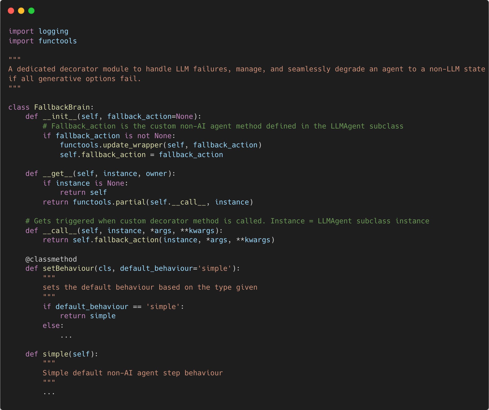
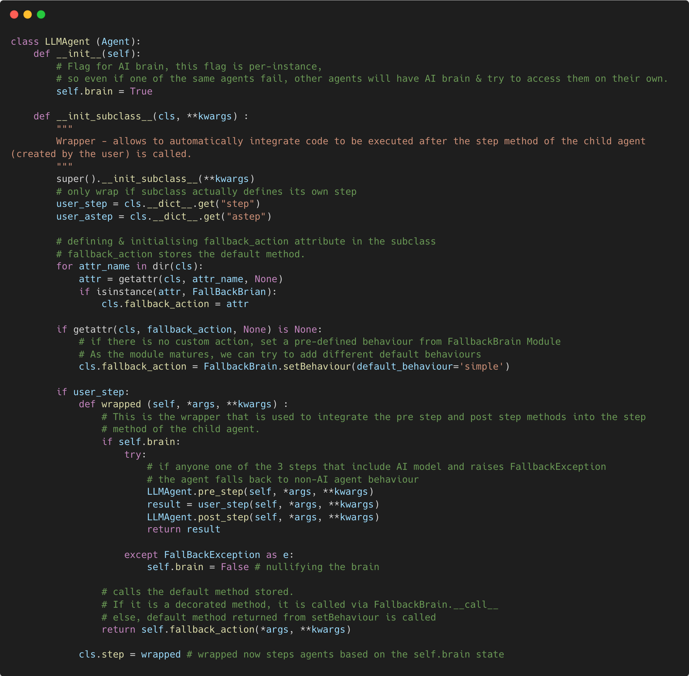
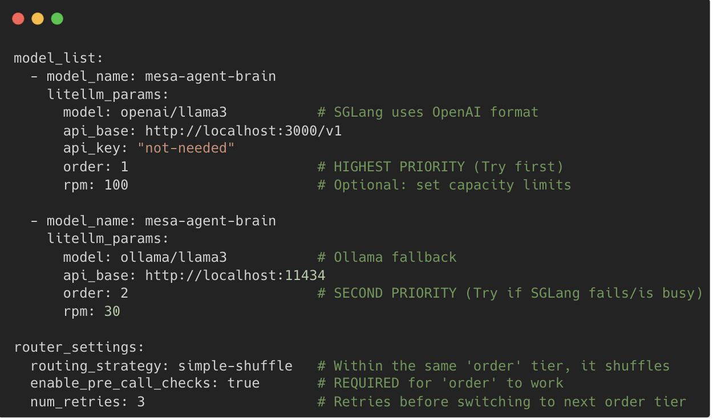
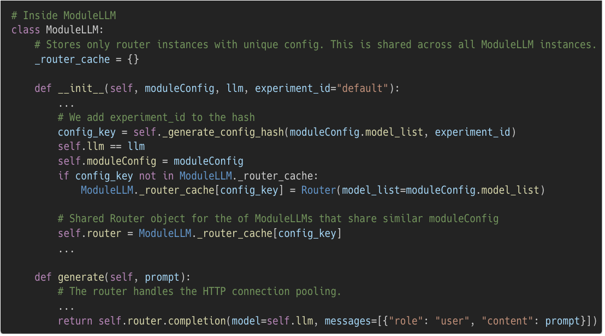
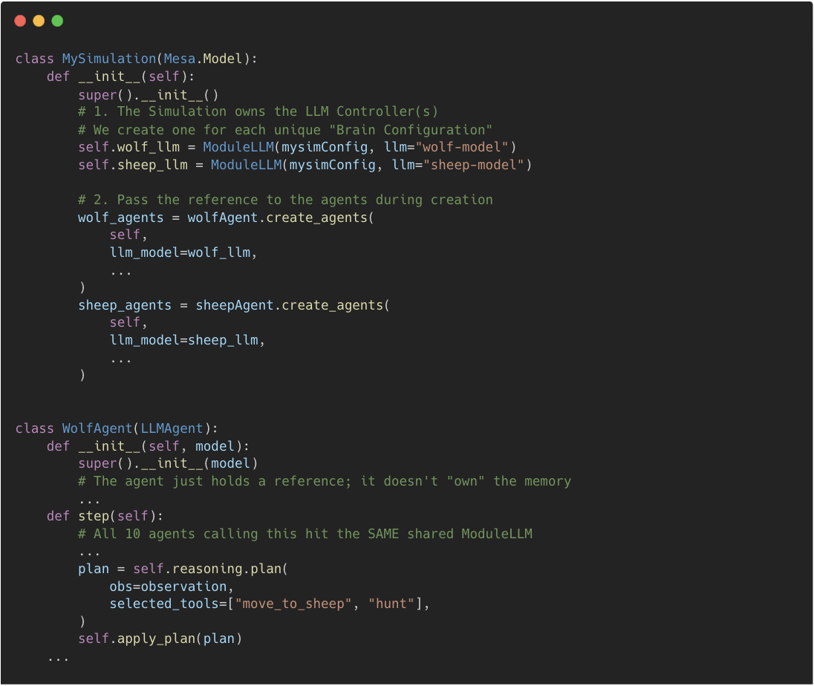

# GSoC Project Proposal

---

## [Mesa-LLM iteration to push to production](https://github.com/mesa/mesa/wiki/GSoC-2026-Project-Ideas#mesa-llms-iteration-to-push-to-production)

**Prepared by:**\
Ilamaran Magesh

**Professional & Academic Details:**\
Applied ML Engineering and Data Professional\
MSc Computer Science\
University of Bristol, United Kingdom\
Expected Graduation: September 2026

**Contact Information:**<br>
[Email](mailto:ilamaran.magesh@gmail.com);
[Github](https://github.com/IlamaranMagesh);
[LinkedIn](https://www.linkedin.com/in/ilamaranmagesh)

---

## **Contributions to Mesa/Mesa-LLM**

Listed some of my notable contributions. Entire list is linked in the
[References](#13-references)

- My introduction -
  [mesa#2465](https://github.com/mesa/mesa/discussions/2465#discussioncomment-15938927)

- [My learning
  space](https://github.com/IlamaranMagesh/mesa-learning-space)

- [My GSoC repo](https://github.com/IlamaranMagesh/GSoC-26-Mesa-LLM)

- Issue - [mesa#3516](https://github.com/mesa/mesa/issues/3516)
  (merged)

- Issue - [mesa-llm#172](https://github.com/mesa/mesa-llm/issues/172)
  (open)

- Issue - [mesa-llm#177](https://github.com/mesa/mesa-llm/issues/173)
  (open)

- Issue - [mesa-llm#178](https://github.com/mesa/mesa-llm/issues/178)
  (open)

- Issue - [mesa-llm#218](https://github.com/mesa/mesa-llm/issues/218)
  (open)

- PR - [mesa-llm#177](https://github.com/mesa/mesa-llm/pull/177) (open)

- Q/A - [mesa#3517](https://github.com/mesa/mesa/discussions/3517)
  (answered)

- Discussion -
  [mesa#3402](https://github.com/mesa/mesa/discussions/3402)
  (Proofreading and polishing docs)

- Discussion -
  [mesa-llm#219](https://github.com/mesa/mesa-llm/discussions/219)
  (recording module bug)

- Discussion -
  [mesa-llm#174](https://github.com/mesa/mesa-llm/discussions/174)
  (model hallucinations & guardrails)

- Some of the PRs reviewed:

  - [mesa-llm#211](https://github.com/mesa/mesa-llm/pull/211) (closed)

  - [mesa-llm#187](https://github.com/mesa/mesa-llm/pull/187) (closed)

  - [mesa-llm#239](https://github.com/mesa/mesa-llm/pull/239) (merged)

  - [mesa-llm#258](https://github.com/mesa/mesa-llm/pull/258) (merged)

  - [mesa#3599](https://github.com/mesa/mesa/pull/3599) (closed)

  - [mesa#3516](https://github.com/mesa/mesa/issues/3516) (merged)

> [!NOTE]
> **Note:** I will be updating this list with new contributions

---

<details>
<summary><h2>Contents</h2></summary>

[**Mesa-LLM iteration to push to
production**](#mesa-llm-iteration-to-push-to-production)

[**Contributions to Mesa/Mesa-LLM**](#contributions-to-mesamesa-llm)

[**1. Abstract**](#1-abstract)

[**2. Motivation**](#2-motivation)

[**3. Scope**](#3-scope)

&nbsp;&nbsp;&nbsp;&nbsp;&nbsp;[**3.1. The Current Landscape**](#31-the-current-landscape)

&nbsp;&nbsp;&nbsp;&nbsp;&nbsp;[**3.2. Simple, Lovable, Complete (SLC)**](#32-simple-lovable-complete-slc)

&nbsp;&nbsp;&nbsp;&nbsp;&nbsp;[**3.3. User Journey, Epics & User Stories**](#33-user-journey-epics--user-stories)

[**4. Technical Approach / Methodology**](#4technical-approach--methodology)

&nbsp;&nbsp;&nbsp;&nbsp;&nbsp;[**4.1. Process Flow**](#41-process-flow)

&nbsp;&nbsp;&nbsp;&nbsp;&nbsp;[**4.2. Phase 1: Code Review**](#42-phase-1-code-review)

&nbsp;&nbsp;&nbsp;&nbsp;&nbsp;[**4.3. Phase 2: Core Stabilisation and Patching**](#43-phase-2-core-stabilisation-and-patching)

&nbsp;&nbsp;&nbsp;&nbsp;&nbsp;[**4.4. Phase 3: CI/CD update and Feature Development**](#44-phase-3-cicd-update-and-feature-development)

&nbsp;&nbsp;&nbsp;&nbsp;&nbsp;&nbsp;&nbsp;&nbsp;&nbsp;&nbsp;[**1. Configurable Fallback Systems**](#1-configurable-fallback-systems)

&nbsp;&nbsp;&nbsp;&nbsp;&nbsp;&nbsp;&nbsp;&nbsp;&nbsp;&nbsp;[**2. Local Model Inference Optimisation and Abstraction**](#2-local-model-inference-optimisation-and-abstraction)

&nbsp;&nbsp;&nbsp;&nbsp;&nbsp;&nbsp;&nbsp;&nbsp;&nbsp;&nbsp;[**3. Optional: Telemetry Dashboard**](#3-optional-telemetry-dashboard)

&nbsp;&nbsp;&nbsp;&nbsp;&nbsp;[**4.5. Phase 4: Developer Experience**](#45-phase-4-developer-experience)

&nbsp;&nbsp;&nbsp;&nbsp;&nbsp;&nbsp;&nbsp;&nbsp;&nbsp;&nbsp;[**1. Documentation**](#1-documentation)

[**5. Deliverables**](#5-deliverables)

[**6. Project Timeline**](#6-project-timeline)

[**7. Personal Motivation**](#7-personal-motivation)

[**8. About Me**](#8-about-me)

[**9. Vision**](#9-vision)

[**10. Commitments & Availability**](#10-commitments--availability)

[**11. Acknowledgments**](#11-acknowledgments)

[**12. AI & Tool Usage**](#12-ai--tool-usage)

[**13. References**](#13-references)

</details>

---

## 1. Abstract

This proposal presents a structured **16-week (350 hours) plan** to
transition Mesa-LLM towards a robust, production-ready framework. The
roadmap is organised into four key phases:

**Phase 1:** Conduct a comprehensive code review to address technical
debt and align the architecture with the upcoming Mesa 4.0 release.

**Phase 2:** Focus on core stabilisation and patching to resolve
critical defects found in Phase 1 that impact existing functionality.

**Phase 3:** Enhance the CI/CD pipeline alongside test-driven feature
development, introducing capabilities such as robust LLM fallback
routing, high-performance local inference enabled by a Controller
Registry pattern and Telemetry.

**Phase 4:** Enhance developer documentation, tutorials, and best
practices aimed at delivering a stable and well-documented Mesa-LLM 1.0
release in alignment with Mesa 4.0.

By leveraging State-of-The-Art advancements in local model optimisations
and applying software engineering practices and patterns, this proposal
aims to enhance Mesa-LLM with **high stability, observability** and
**low latency** without bringing any breaking changes to the existing
code base.

## 2. Motivation

Generative AI is transforming paradigms\[1,2\] across multiple domains,
and Agent-Based Modelling (ABM) is no exception. Mesa-LLM provides a
strong foundation for enabling AI-driven ABM, where AI serves as the
"brains" of agents, allowing researchers to observe complex emergent
behaviours that closely approximate real-world phenomena.

Generative models, while highly capable, are inherently unreliable when
used in isolation, exhibiting issues such as hallucinations and
unpredictable edge cases\[3\]. To fully realise their potential, they
must be integrated with systems that are both controlled and
deterministic, ensuring reliability while preserving dynamic, "alive"
behaviour. The proposal aims to resolve underlying issues within the
project by improving its **reliability** and **stability of the APIs**,
updating the **CI/CD pipelines**, **optimising local model inference
latency**, writing **new tutorials**, and **best practices**, enhancing
existing **documentation readability**, and optionally increasing
**observability** by providing token usage, RPM and compute **metrics
dashboard** for the researchers and developers, ultimately pushing the
framework towards production readiness.

## 3. Scope

The primary objective of this proposal is to transition **Mesa-LLM**
from its current **experimental** state towards a **robust,
production-ready** extension. As of March 2026, while the foundation
exists, the framework has critical bugs, and need enhancements to be
widely adopted by academic and professionals of different domains.

### 3.1. The Current Landscape

**Testing:** While basic unit tests exist, the framework lacks
comprehensive End-to-End (E2E) validation and coverage for complex
edge/corner cases (e.g., API failures, rate limiting, front-end failures
or malformed LLM outputs) (see [pg-7](#42-phase-1-code-review))

**Stability:** Current bugs in the core logic prevent existing features
from being fully functional in high-stakes simulation environments (see
[pg-7](#42-phase-1-code-review))

### 3.2. Simple, Lovable, Complete (SLC)

The goal is to address existing **issues/bugs** and **develop
features** that are '**S**imple', '**L**ovable', and
'**C**omplete'

**Simple** - A feature/software should be **Simple** enough for the
researchers to not worry about 'how to implement?' or the process behind
the scenes.

**Lovable** - A software should have features that makes working with
it **Lovable** - should solve more problems than it creates, providing
intuitive interfaces, frictionless usage experience and helpful
debugging tools. It should have detailed on-boarding guide, tutorials
and API references.

**Complete** - A feature/software should have baseline
**completeness** - a state where the feature/software is functionally
entire allowing a user to run a full simulation without needing external
workarounds, ensuring that any future capabilities are perceived as
**supplementary advancements** rather than corrections to an unfinished
core.

### 3.3. User Journey, Epics & User Stories

As a software engineer, I aim to adhere to established industry
standards. Rather than just fixing bugs and adding features that makes
the framework 'cool', this proposal is built on **User
Journeys.**

Given that my research/interest focuses on implementing AI-as-brains in
games, AI-driven Agent-Based Modelling (ABM) serves as a key tool for
prototyping. As an active user of **Mesa-LLM**, I have outlined **my
user journe**y\[11\] to inform the proposed features. Based on this, I
have identified a set of user stories from epics, which are detailed in
[Technical Approach/Methodology.](#4technical-approach--methodology)

Some questions that the proposal aim to address -

- How -
  - \...reliable are the simulations?

  - \...I manage the model/agents?

  - \...is the framework fail-safe?

- What -

  - \...makes it better than traditional ABM?

  - \...if I'm new to ABM?

  - \...are the best practices to model?

---

## 4.Technical Approach / Methodology

To achieve a production ready status, this proposal addresses critical
technical questions through a series of **User Stories** with **SLC** in
mind.

> [!NOTE]
> ***Note:** All the user stories from the epics are written from my 
> perspective as a user of Mesa-LLM. Features that make the framework
> **SLC** according to me.*

### 4.1. Process Flow


### 4.2. Phase 1: Code Review

While the current codebase provides a robust foundation, a
comprehensive code review is essential to ensure alignment with the
upcoming Mesa 4.0 architecture. The priority is to focus on a
high-quality baseline rather than immediate feature growth. By
prioritising clean, maintainable code, we ensure the framework can scale
effectively without becoming a maintenance burden and encourage
contributions from developers.

**Preliminary Work Done:**

**1. Current Type hints & checks**

The current codebase has configurations of **mypy** but static checking is not done. After
generating a report from mypy, I found that there were multiple
inconsistencies in the type hints, including discrepancies in
docstrings\[12\]. Multiple PRs and issues from other contributors have
also been raised on this issue\[10\].

**Significance -** docstrings that are inconsistent with type hints
and no type hints, cause unpredictable errors. Having this fixed early
makes feature development easier.

**2. Current Test Coverage**

The current code base as of Mar 25, 2026 has good unit tests and code coverage (lines covered -
91%; branches covered - 78%) with all the major branches covered. It tests all the methods and classes.

I have listed out key findings from the codecov report below\[12\].

**Key Findings:**

- One branch in **tool_manager.py** is completely untested, **line:
58-107**\[12\]. Other than that, all the major branches have been
tested.
- There is an existing integration test suite for reasoning and
memory modules\[12\] but I couldn't find any E2E tests for examples and
tutorials. Mesa core uses **Playwright** for E2E, similar test suite can
be developed with mock model, memory and reasoning modules.

**Significance** - E2E tests make sure that the examples and tutorials
work with the visualisation. Each example might have different layout
and elements, which adds more importance to E2E testing.

**Work In Progress:**

**1. Making Mesa 4.0 Compatible**

Updating the code base for the breaking changes in Mesa 4.0. There are Issues and PRs that have highlighted few
incompatibilities\[7\]. Using those as baselines, I will refactor the
codebase to address the breaking changes listed on the Mesa 4.0
[discussion#3132](https://github.com/mesa/mesa/issues/3132) and release notes.

**Significance** - With Mesa 4.0 release in near future, having new
features built on top of the updated Mesa-LLM makes sure the new and old
features don't break on release.

**2. Manual Code Review & Refactoring** 

The code review is done by manually looking at the modules for overall high-level architecture,
going through the execution path using debuggers, seeing if the code is
self-documented for readability, also checking the docstrings and
comments.

The review is done across the entire code base once to check for

- Hidden side effects:
  - **Significance** - saving a recording, adding a
    memory or any actions should not have unintended results. Multiple
    issues have been raised on unintended behaviour during the simulation
    and recording\[8\].


- Error Handling:
  - **Significance** - Since AI-driven agents involve
  multiple API calls and communications, having a readable and verbose
  error messages (LiteLLM provides a 200+ lines JSON error message\[9\])
  on failures will help developers debug the issue and avoiding simulation
  to stop abruptly.

### 4.3. Phase 2: Core Stabilisation and Patching

Following the initial code review and reports, **Phase 2** focuses on
resolving the identified issues through targeted patches. Findings from
the **Phase 1** will be detailed in an **Analysis Report**, if required
from the maintainers. By establishing this alignment early, we ensure
that the framework\'s foundation is structurally sound before any new
features are introduced in **Phase 3**.

**Success Criteria** -

- Writing unit tests in Mesa-LLM for the new / updated features from Mesa 4.0,
making sure it's intended behaviours with Mesa-LLM


- Writing mock E2E tests for the existing tutorials and examples using
**Playwright**, similar to Mesa


- By addressing the identified issues,
  - Mesa-LLM will be made compatible for Mesa 4.0.
  - Existing major bugs / issues that cause side effects will be removed
  - Static type checking will be implemented and current type hint issues will be
  cleared

### 4.4. Phase 3: CI/CD update and Feature Development

Upon stabilising the core in Phase 2, this phase is sub-divided into
two parts.

1. Focuses on fortifying the CI/CD pipeline to align with the core Mesa
release cadence.

2. Feature development.

**Part 1**

**First part of Phase 3 -** prioritises the enhancement of the Mesa-LLM
CI/CD infrastructure.

With my previous experiences in developing CI/CD pipelines\[13\], my work will focus on:

- **Deployment of static type checks:** Transitioning the existing mypy
configuration into an active CI gate to ensure code quality and prevent
runtime failures.\[12\]\
**Success Criteria -** Activating **mypy** for strict type enforcement.


- **Expansion of Test Coverage:** Deploying the suite of E2E tests
developed in Phase 2 to the pipeline.\
**Success Criteria** **-** Deploy mocked **E2E tests** using
**Playwright** for LLM-driven agent architectures to the pipelines.


- **[Documentation](#1-documentation):** Automating **Sphinx** validation
builds to ensure that the docs are built with every code updates.\
**Success Criteria** **-** Docs are built on every code changes.**Part
2**

> [!NOTE]
> **Note** - I have prioritised some of the user stories that completes
> the core functionalities of Mesa-LLM from my user journey and epics. It
> is important to note that, subject to the maintainers' approval and
> overall direction, implementations can be updated.

**The second part of this phase**, focuses on the feature development.
Mesa-LLM has already most of it's basic features, the proposed features
enhance the current capabilities **without** making any **major** and
**breaking changes** to the codebase.

All the approaches taken to solve the user stories are meant to keep
the features **Simple, Lovable,** & **Complete**

#### 1. Configurable Fallback Systems

This feature adds a fallback module which is activated when an
AI-driven Agent fails to generate responses. This feature and the next
[feature](#2-local-model-inference-optimisation-and-abstraction) proposed is designed in a way to complement each
other.

**Why it is needed?**

- Failure of an AI-driven agent in a simulation can break the entire
experiment, losing AI/compute credits, invaluable time and
efforts. 


- Simulations are run for N number of steps and multiple
experiments, having a robust system makes sure the simulations run
without corruption and minimises the losses.

**Success Criteria:**

Default fallback action for an AI-driven agent when it fails to run a
step. When the primary model fails

1. Secondary backup AI model takes over, if this fails,

2. A non-AI agent takes in-place of the AI-driven Agent for the rest of
the simulation.

**Approach:**

I have broadly classified the errors that can occur during response
generation into 2 categories,

- **API/LLM failure** - The agent tries to think, but the primary LLM is
unavailable even after exponential back-off (e.g., an OpenAI API
outage). The system should seamlessly route the prompt to a secondary
LLM.


- **Agent failure** - The agent fails to execute a step entirely (e.g.,
both brains fail, or the LLM returns an unparsable response). The system
should execute a safe, deterministic default action (e.g. a non-AI
Agent) to keep the simulation running.


**High Level Architecture:**

There are **three level** of fallback stages to this design. Instead of
modifying the core **ModuleLLM** class to handle complex retry logic, we
create a **FallbackBrain** that is activated when the first two layers of AI-brain fail.
This FallbackBrain holds the default non-AI agent behaviours and providers decorators for custom default actions.


The simulation model (Mesa.Model) attempts the
primary brain (AI model) and, upon catching an exception, routes to the
backup secondary brain (AI model). When both of these fail, fallback
action (non-AI) is called.

**A. The Backup \'Brain\' (First & Second layer - Composite Pattern)**

The first two layers are managed by leveraging the existing feature of
LiteLLM, **router API.** The users need to provide only the
**configuration** and the rest is handled by the system. The next
[feature](#2-local-model-inference-optimisation-and-abstraction) section talks in detail about the configuration.
This is useful where the researchers could use a heavy cloud model as
the primary, and if rate-limited or fails, fall back to a local,
quantised GGUF model running via Ollama/vLLM to keep the simulation
moving without crashing.


**Control Flow:**

- The **LLMagent** owns a **primary_brain** and, optionally, a
**secondary_brain** via the **configuration**. The primary brain does
not know the fallback exists. This way the fallback system is kept
modular.


- The **LiteLLM** **Router API** tracks failure counts. When the
max_retries threshold is crossed on both the brains, the fallback system
actively intervenes in the agent\'s state by setting **agent.brain =
False**.


- Once agent.brain is nullified, the agent bypasses the AI response
generation step entirely in future ticks, relying purely on its
**fallback_action** (a standard Python method or function) to interact
with the Mesa grid.


**B. The Default Fallback Action (Third Layer)**

**New FallbackBrain Module:**



**Existing LLMAgent Module:**



This system is called inside the **LLMAgent** class, specifically in
**\_\_init\_\_subclass()** wrapper, so that **fallback_action** is set
at initialisation. Whenever the error is raised, it sets the
**agent.brain=False** and triggers the fallback system. It can be
designed to either **fail fast** in the absence of a configured fallback
or default to a **deterministic state** (e.g., a stale or inactive
state). Failure of one agent instance of the same class will not change
the behaviour of other agent instances. While the exact implementation
may vary based on design decisions, this captures the intended overall
behaviour.

#### 2. Local Model Inference Optimisation and Abstraction

The local model inference currently depends on Ollama(**Batching**) or
VLLM(**PagedAttention**) runtime and the current design expects the
researchers/developers to handle their own local servers. This feature
abstracts the backend handling for new users but still keeps the option
of customisation for experienced users. By doing so, we can leverage the
SOTA local inference runtime, SGLang\[5\].

**Why it is needed?**

- New users find it difficult to manage their own local runtime, needing
to understand runtime specific details.


- Users need not learn newly released local servers / runtimes every time.


- Keeping the backend logic abstracted, researchers can focus on ABM and experiments - What the
framework intends to provide to the users. 


- SGLang optimises the local
inference time much better than Ollama or vLLM\[5\], providing
significant performance upgrade without any breaking updates to the
existing code.


**Success Criteria:**

If local inference, users provide custom config, or else default config
is applied where it uses an optimised SLM via **SGLang** runtime. The
module handles the server and models with robust error
handling.

**Approach:**

Optimisations in local inference is one of the highly researched areas.
There are new approaches and methods everyday but one method stands out,
**RadixAttention**[a], from batching and PagedAttention.

**RadixAttention** was primarily developed as part of the **SGLang**
inference engine. As of March 2026, the engine doesn't have a direct
implementation using LiteLLM\[14\] however, it is possible to provide
the support as both share similar API protocol (OpenAI API).

Even if there's a future support to the runtime in LiteLLM, there will
be a minimal change required only in the model name used from
**'openAI/local-model'** to **'\<litellm.sglang\>/local-model',** since
the approach doesn't change the existing behaviour but refactors and add
abstraction.

**Why SGLang?**

Built for speed and multi-agent workflows. It uses **RadixAttention**,
which allows agents to share the same \"world state\" KV cache. If 100
agents have the same system prompt, SGLang only computes that prompt
once\[5\].

**Process Flow**

The flow is very similar to other engines like **Ollama,** and
**vLLM**. So we can leverage this and have model aliasing within the
**LiteLLM config**. This introduces an additional layer of abstraction,
decoupling the agent\'s logic from the underlying runtime. This is
explicitly managed during **Step B** of the defined process flow. By
default, **SGLang** will be the runtime for local model inference as it
supports even GGUF models, like Ollama. The user will also have an
option to set their runtime in the config.


**New Modules & Files:**

1. **ModuleController** - If local inference, starts the local server and
handles the router configurations from the ModuleConfigParser, if
needed.


2. **ModuleConfigParser (Optional)** - Parses the ModuleConfig set
for **ModuleLLM**. Needed only if the config is set in a serialisation
format (JSON, TOML, etc.)


3. **ModuleConfig** - An object to store the
config for modules.For the model handling, LiteLLM's **router API** is
used in this approach\[6\]. This API also does the Fallback handling for
AI brains that is introduced in the previous feature.

<a name="Modconfig"></a>

**Sample ModuleConfig for the router (.yaml)**



The snippet shows the config in **.yaml** format for clarity but the
final data structure is decided after aligning with maintainers. By
providing an additional tier of abstraction, this setup ensures that
researchers can focus on high-level experimentation without the
operational overhead of managing engine-specific configurations. It also
allows for seamless transitions between different local and cloud-based
inference providers while maintaining a consistent interface for the
agents. This implementation also complements the requirements of [1.
Fallback Systems](#1-configurable-fallback-systems), demonstrating a multi-engine
architecture featuring automated fallback capabilities.

**Implementation**

**Current Architecture**


Each **LLMAgent** instance instantiates a separate **ModuleLLM**,
despite identical configuration across agents. Consequently, every
**ModuleLLM** establishes its own **HTTP** connection to the server,
introducing unnecessary overhead and negatively impacting overall
performance.

**Proposed Architecture (Controller Registry Pattern)**


**Sample code snippets**



LiteLLM provides robust support on the backend routing via **router**
API. This instance is stored in the ModuleLLM. Similar configs will have
same router instance.



By relocating the instantiation of **ModuleLLM**
from **LLMAgent** to the **Mesa.Model** class, simulation-level
instances of **ModuleLLM** can be created. Here the **mysimConfig** is
similar to the config [example](#modconfig) shown above. This enables
agents with identical configurations to share a **common router
instance**, thereby significantly reducing overhead and improving
performance. Also providing a way for defining common config for the
backend models

Below comparison provides a simple view of the different architectures
from the current to proposed


  


#### 3. Optional: Telemetry Dashboard

As a stretch goal, I aim to implement this feature as an enhancement to
the observability, subject to available time during the GSoC
period.

**Why it is needed?**

- ABM in general is driven by multiple agents for multiple steps. Tokens,
GPU and CPU usage will be substantial even with as small as 10
agents.


- Real-time telemetry dashboard will help users to take decisions
on AI models, and experiments

**Success Criteria:**

A dashboard that provides real-time pre-defined metrics like token,
GPU, CPU usages per experiment. Users can define their own metric
functions and provide it via recording decorators.

**Approach:**

I have detailed the approach in this **discussion [#178](https://github.com/mesa/mesa-llm/issues/178#issue-4042295840)**

### 4.5. Phase 4: Developer Experience

This final phase focuses on the documentations of Mesa-LLM.

#### 1. Documentation

The current documentation includes all the essential sections expected
of a Python framework; But there can be more beginner friendly tutorials
like the existing negotiation example and enhancement of getting-started
guides to add clarity and easy on-boarding of the developers. As of
mid-March 2026, docs are not fully aligned with recent framework updates
and Mesa 4.0\[11\].

The following improvements are proposed:

- Enhance tutorials by:
  1. Introducing **interactive, live tutorials** via
  Google Colab integration, leveraging the existing notebooks in docs.
  This will give users a demo of the framework without having to setup an
  environment on their own.
   
  2. Adding **visual architecture diagrams** and
  **logic flow** representations of Mesa-LLMConduct a comprehensive review
  of the documentation to address **typographical errors,
  inconsistencies,** and **clarity issues**
  
  3. Introduce a dedicated **Best Practices / Developer Recommendations** section, covering:Prompt
  engineering patternsCost and latency optimisation strategies
  
  4. Add a "What is ABM?" section which provides resources and guides to understand ABM
  that can also be integrated into Mesa's core documentation
  
  5. Enhance the current **contribution workflow** docs with detailed, clear guidelines
  for **pull request (PR) triage** and **review processes**

## 5. Deliverables

This section contains all the listed deliverable across **Phase 1**
through **Phase 4** along with the corresponding criteria used for
defining their completion.


| **Phases**                                    | **Criteria of Completion**                                                                                                                                                                                                                                                                                                                                                                                                                                                                                                                                                                                                                                                                                                                                                               |
|-----------------------------------------------|------------------------------------------------------------------------------------------------------------------------------------------------------------------------------------------------------------------------------------------------------------------------------------------------------------------------------------------------------------------------------------------------------------------------------------------------------------------------------------------------------------------------------------------------------------------------------------------------------------------------------------------------------------------------------------------------------------------------------------------------------------------------------------------|
| **1: Code Review**                            | A formal **review** of the codebase with issues/bugs listed in GitHub                                                                                                                                                                                                                                                                                                                                                                                                                                                                                                                                                                                                                                                                                                                    |
| **2: Mesa-LLM Core Stabilisation & Patching** | **Issues and bugs** listed are **addressed** in alignment with the maintainers. Some actionable items (not limited to) are detailed here.                                                                                                                                                                                                                                                                                                                                                                                                                                                                                                                                                                                                                                                |
| **3: CI/CD Update & Feature Development**     | **0.1.** Static analysis CI gate, E2E test coverage, automated documentation validation deployed to the CI/CD workflow.<br><br>**1.0. Robust LLM/API fallback routing** (Composite Pattern with retry + backup model) and deterministic agent fallback actions ensuring simulation stability.<br><br>**2.0.** High-performance execution and an extra layer of abstraction for AI model configuration with **Controller Registry Pattern** (shared ModuleLLM at Model level), reduced HTTP overhead, and advanced caching compatibility (RadixAttention / prefix caching).<br><br>**3.0. (Optional)** As a stretch goal, real-time native **telemetry dashboard** displaying token usage, latency, hardware metrics, and supporting RPM limits without interrupting the simulation loop. |
| **4: Developer Experience**                   | Completed codebase/documentation audit, added live tutorials, architectural diagrams, published best practices (prompt engineering, cost/latency). Added ABM introduction and defined contributor workflow with PR triage.                                                                                                                                                                                                                                                                                                                                                                                                                                                                                                                                                               |


## 6. Project Timeline

According to the GSoC timeline, the official coding period runs from
**May 1, 2026 to August 24, 2026**, spanning a total of approximately
**16 weeks and 3 days**. As a master's student, I plan to contribute on
a part-time basis, dedicating 20 hours per week, resulting in an
estimated total effort of about \~**350 hours**.

The project timeline has been structured accordingly, with approximate
allocations of time and effort across phases. Additionally, a buffer of
one week has been kept for each phase, so the phases overlap for a week
to ensure flexibility and continuity.

Each Phases are allocated **tentative hours** based on the
deliverables.


| **Phase**                             | **Duration**                        |
|---------------------------------------|-------------------------------------|
| Phase 1 - Code Review                 | Weeks: ~1 to 2<br>Hours: 20 to 40   |
| Phase 2 - Mesa-LLM Core Stabilisation | Weeks: ~3 to 4<br>Hours: 60 to 80   |
| Phase 3 - CI/CD & Feature Development | Weeks: ~7 to 8<br>Hours: 140 to 160 |
| Phase 4 - Developer Experience        | Weeks: ~1 to 2<br>Hours: 20 to 40   |


## 7. Personal Motivation

My personal interest towards ABM stems from my current research focus
on the application of AI in games, particularly in areas such as
autonomous NPC behaviour, game world creation, and dynamic world
updates. Because of the power-hungry nature of AI models, my work
extends deeply into space and performance optimisation, specifically
focusing on model quantisation. My goal is to fit these models
efficiently on-device while preserving the intelligence required for
these complex NPC interactions. To say it in short, my two primary
interests and works are implementation of AI game systems and the
technical optimisation and quantisation of models for local,
high-performance game environments.

As a reason, AI-driven NPCs still remain in an early stage of
development, with complex emergent behaviours not yet fully understood -
developing experimental prototypes is a necessary first step. This
motivated me to explore AI-driven ABM approaches and techniques for
implementing autonomous, "conscious" NPCs.

This exploration led me to **Mesa** and **Mesa-LLM**. Given that
**Mesa-LLM** is currently in an experimental phase, it presents a
valuable opportunity to contribute to its growth and evolution. This
also aligns well with my research needs, as I require a robust tool for
modelling and simulation. Within the Python ecosystem, I did not
identify other ABM frameworks with a similarly mature foundation as
Mesa, making Mesa-LLM a particularly strong candidate for advancing
AI-driven ABM. Though there are other AI-Agent orchestration tools like
**LangGraph**, and **CrewAI**, they are primarily meant to be for
agentic AI workflows and typically requires building most of the agent
environment from scratch.

As a coincidence, while planning to apply for the GSoC to make
productive use of my summer during my master's programme, I found that
Mesa is also an participating organisation.

This is one of the moments where one might say,

```text
"The threads of fate have finally begun to intertwine.\"\
- Igor, Persona 5]{.mark}\
```

And regardless of the GSoC, I'd still intend to contribute to the
project as it is directly supports my ongoing work in modelling and
simulation.

## 8. About Me

I am currently pursuing a Master of Science in Computer Science at the
University of Bristol, United Kingdom, and expect to graduate in
September 2026. I have practical experience in AI/ML, software
engineering, data science, and data engineering. I'm also currently
working as a Part-Time Data Analyst where the contract ends in May 2026,
so I'll be able to contribute to the project fully for the whole GSoC
period.

From June 2026, I will be undertaking my thesis, which focuses on
developing a fully local AI assistant powered by on-device models,
capable of processing and retaining documents, meeting notes, and other
contextual information within local memory. Given that my research
centers on AI agents in games and system optimisation, this work will
provide valuable expertise in local model optimisation - an area
directly relevant to the core challenges need to be addressed in
Mesa-LLM.

In addition to my academic work, I have completed several relevant
personal projects. Notably, I implemented the Word2Vec CBOW model using
only NumPy, demonstrating a strong foundation in first-principles
thinking and a deep understanding of underlying concepts. Another key
project involves a 3D simulation built using WebGL, where my experience
with HTML5 Canvas, front-end development, and rendering techniques can
contribute to optimising agent simulations within Mesa.

## 9. Vision

My vision of Mesa-LLM is rooted in the belief that the next frontier of
ABM lies in the accessible, efficient integration of AI models within
complex simulation environments. Researchers and developers shouldn't
feel any friction on-boarding and using Mesa-LLM.

**In the short term**, my goal for this GSoC project is to drive
Mesa-LLM towards stabilisation and production readiness. Mesa offers a
uniquely mature foundation for true environmental simulation. By
leveraging my background in first-principles machine learning and local
model optimisation, I aim to refine Mesa-LLM so that researchers can
seamlessly simulate complex, LLM-driven agent interactions such as
memory retention and context-sharing without prohibitive computational
overhead. Bridging this gap will make Mesa-LLM a robust, immediate asset
for researchers requiring highly optimised, on-device modelling
tools.

**In the long term**, I envision Mesa-LLM evolving into the definitive
framework for studying emergent, \"conscious\" agent behaviours. Drawing
from my ongoing research into autonomous game NPCs and model
quantisation, I aim to push Mesa-LLM beyond just running few tens or
hundreds of agents, enabling it to scale efficiently to thousands by
staying aligned with emerging research and applying robust software
engineering practices. By facilitating complex multi-agent ecosystems to
run natively and efficiently, we can empower the broader research, data
science, and broader communities to build, observe, and interact with
dynamic AI-driven models, fundamentally expanding the scope of ABM to
wider range of industries and applications.

## 10. Commitments & Availability

I am committed to contributing to the Mesa community **beyond the
GSoC** period. Regardless of whether I pursue a career in research or
industry, I intend to continue exploring and developing AI-driven game
systems as personal projects, and therefore aim to provide sustained,
**long-term contributions** to the project.

During the GSoC period, I will be available on a **part-time** basis,
with an estimated commitment of approximately **350 hours** over the
duration of the programme.

## 11. Acknowledgments

Special thanks to Steve Leach, a software engineering veteran with over
50 years of experience, for his mentorship and introducing me to the
**SLC** approach. I am also grateful to Prof. Ruzanna Chitchyan, and Dr.
Jo Hallett for their invaluable feedback and guidance.


## 12. AI & Tool Usage

The following are the areas where AI has been used in this
proposal:

**Documentation**: I wrote the contents of the documentation and I used
Gemini, and ChatGPT to rephrase and enhance the language in some parts
with the context unchanged.

**Code**: I wrote the code snippet templates and I used Gemini to add
fillers and docstrings.

**Mermaid Diagrams**: I designed the architecture diagrams. I used
Gemini, and ChatGPT to write boilerplates for Mermaid code and I
customised on top of that.

**Other Charts:** I used draw.io and Lucidspark to create the charts.
No AI was used in the tools.

**Learning & Ideation:** I used Gemini only to research and learn
concepts, best-practices, and industry approaches for the project. AI
was neither used to design the strategies nor the architectures
proposed.

**Prototyping:** I used GitHub Copilot to generate a mock-up prototype
of my design in my forks of the project.

## 13. References

\[1\]
<https://www.gartner.com/en/articles/top-technology-trends-2026>

\[2\]
<https://www.mckinsey.com/capabilities/quantumblack/our-insights/the-state-of-ai>

\[3\] <https://www.jmir.org/2024/1/e53164>

\[4\]
[https://www.frontiersin.org/journals/artificialintelligence/articles/10.3389/\
frai.2025.1622292/full](https://www.frontiersin.org/journals/artificialintelligence/articles/10.3389/frai.2025.1622292/full)

\[5\] Devpost comparing performance of local inference engines -
<https://dev.to/zkaria_gamal_3cddbbff21c8/concurrent-llm-serving-benchmarking-vllm-vs-sglang-vs-ollama-1cpn>

\[6\] LiteLLM Router API -
<https://docs.litellm.ai/docs/routing>

\[7\] Updates for Mesa 4.0 \[Issues/PRs in Mesa-LLM\] -
[#195](https://github.com/mesa/mesa-llm/pull/195)
[#217](https://github.com/mesa/mesa-llm/pull/217)
[#153](https://github.com/mesa/mesa-llm/pull/153)

\[8\] Unintended behaviour \[Issues/PRs in Mesa-LLM\] -
[#107](https://github.com/mesa/mesa-llm/issues/107)
[#208](https://github.com/mesa/mesa-llm/pull/208)
[#218](https://github.com/mesa/mesa-llm/issues/218)
[#224](https://github.com/mesa/mesa-llm/pull/224)

\[9\] API Error in Mesa-LLM \[PR in Mesa-LLM\]-
[#258](https://github.com/mesa/mesa-llm/pull/258)

\[10\] Type hints and docstrings \[Issues in Mesa-LLM\] -
[#170](https://github.com/mesa/mesa-llm/pull/170)

\[11\] Docs \[Issues in Mesa-LLM\] -
[#213](https://github.com/mesa/mesa-llm/pull/213)

\[11\] User Journey -
[github/GSoC-26-Mesa-LLM](https://github.com/IlamaranMagesh/GSoC-26-Mesa-LLM/tree/80caf3f5808aa944c8199d6186150f1e49fed481/My User Journey)

\[12\] Test and Type check reports -
[github/GSoC-26-Mesa-LLM](https://github.com/IlamaranMagesh/GSoC-26-Mesa-LLM)

\[13\] CI/CD development experience -
[github/gameDev](https://github.com/UoB-COMSM0166/2026-group-20/tree/bbd2010ae10f48d52f5162bee9504362b9df0f14/.github/workflows)

\[14\] LiteLLM/discussion -
[#13681](https://github.com/BerriAI/litellm/issues/13681)

\[15\] My entire contributions - mesa
\[[PRs](https://github.com/mesa/mesa/pulls?q=involves%3Ailamaranmagesh),
[issues](https://github.com/mesa/mesa/issues?q=involves%3Ailamaranmagesh),
[discussions](https://github.com/mesa/mesa/discussions?discussions_q=involves%3Ailamaranmagesh)\];
mesa-llm
\[[PRs](https://github.com/mesa/mesa-llm/pulls?q=involves%3Ailamaranmagesh),
[issues](https://github.com/mesa/mesa-llm/issues?q=involves%3Ailamaranmagesh),
[discussions](https://github.com/mesa/mesa-llm/discussions?discussions_q=involves%3Ailamaranmagesh)\]

[a]: ***RadixAttention** is a technique designed to optimise the
    Key-Value (KV) caching mechanism in Large Language Model (LLM)
    serving. It addresses the high memory and computational costs of
    serving LLMs by automatically identifying and reusing common
    prefixes across multiple requests, particularly in multi-turn
    conversations or prompts utilising templates.*
